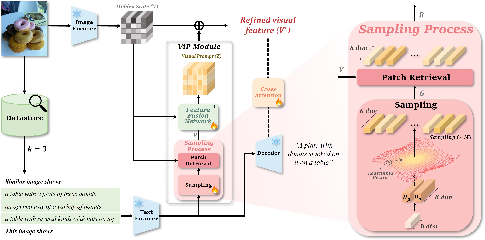
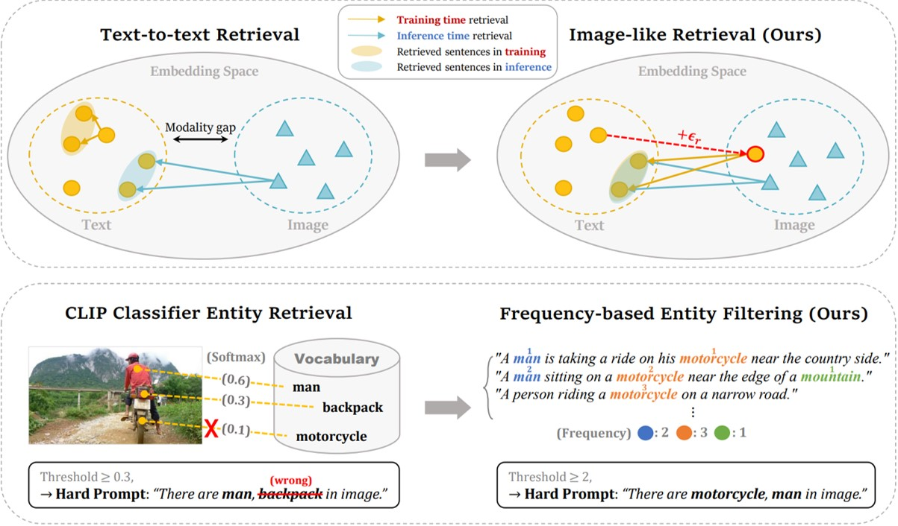

Hi! I am a Visual prompt researcher in Vision & Language models. Prior to joining Microsoft at March 2020, I earned my Ph.D. in Computer Science from School of Interactive Computing at [Georgia Tech](https://www.gatech.edu) with thesis "[**Structured Visual Understanding, Generation and Reasoning**](https://repository.gatech.edu/entities/publication/93299669-0326-445a-adbb-b6050cd2eec9)". I was fortunate to be supervised by [Prof. Devi Parikh](https://cc.gatech.edu/~parikh/) and work closely with [Prof. Dhruv Batra](https://www.cc.gatech.edu/~dbatra/).
<!-- My research interests span in computer vision, vision & language and machine learning. More specifically, my primary researches are about structured visual understanding at different levels and how to further leverage them for intelligent interactions with human through language and environment through embodiment. I believe, by integrating fine-grained structured information, we can achieve better yet interpretable, grounded and robust multi-modality intelligent agents. -->

My current research is focused on building **generalist multi-modal agent**. Our team are the first few in this line of research, and have produced a series of works, including (a) bridging core vision tasks with language: [UniCL](https://arxiv.org/abs/2204.03610), [RegionCLIP](https://arxiv.org/abs/2112.09106), [GLIP](https://arxiv.org/abs/2112.03857), [KLITE](https://arxiv.org/abs/2204.09222), foundation model [Florence](https://arxiv.org/abs/2111.11432); (b) developing generalist decoder [X-Decoder](https://x-decoder-vl.github.io/), and (c) enabling more promptable, grounding and interactive systems like [SEEM](https://github.com/UX-Decoder/Segment-Everything-Everywhere-All-At-Once), [Semantic-SAM](https://github.com/UX-Decoder/Semantic-SAM), [LLaVa](https://github.com/haotian-liu/LLaVA), [SoM Prompting for GPT-4V](https://som-gpt4v.github.io/), and [Phi-3-Vision](https://arxiv.org/pdf/2404.14219). I believe, further pushing forward, we can achieve performant yet interpretable, grounded and robust multi-modality intelligent agents.

**If you are interested in working with me, please feel free to drop me an email through [taewhan7725@gmail.com](taewhan7725@gmail.com).**

<h2>Research News</h2>
**\[12/2024\]** [ViPCap](https://arxiv.org/abs/2412.19289) is accepted by [AAAI 2025](https://aaai.org/)  
**\[09/2024\]** [IFCap](https://arxiv.org/abs/2409.18046) is accepted by [EMNLP 2024](https://2024.emnlp.org/)  

<!--
<h2>Academic Activities</h2>
**\[09/2024\]** Have a great panel discussion about the next generation multimodal models at [Microsoft Research Forum Session 4 on Multimodality](https://researchforum.microsoft.com/). 
**\[07&08/2024\]** Serve as an Area Chair for [NeurIPS 2024](https://neurips.cc/) and [ICLR 2025](https://iclr.cc/Conferences/2025). 
**\[06/2024\]** Gave a tutorial on "<u>A Close Look at Vision in Large Multimodal Models</u>" \[[slides](https://datarelease.blob.core.windows.net/tutorial/vision_foundation_models_2024/Jianwei_vision_in_LMM.pdf)\] \[[youtube](https://youtu.be/bDVbs-fZGUg)\] at [CVPR 2024 Tutorial on Recent Advances in Vision Foundation Models](https://vlp-tutorial.github.io/). 
**\[06/2024\]** Gave a keynote talk on "<u>Promptable Vision Foundation in the Wild: From Head to Tail</u>" at [CVPR 2024 Worshop on Computer Vision for Materials Science](https://sites.google.com/view/cv4ms-cvpr-2024/home). 
**\[06/2024\]** Organized the [3rd Computer Vision in the Wild (CVinW) Workshop at CVPR 2024](https://computer-vision-in-the-wild.github.io/cvpr-2024/). 
**\[05&06/2024\]** Invited talk on "<u>Towards General-Purpose Multimodal Agent</u>" at University of Washington and Together AI. 
**\[07/2023\]** Panel Discussion on AI Frontier at WAIC and invited talk on "<u>Towards General-Purpose Multimodal Agent</u>" at IDEA. 
**\[06/2023\]** Gave a tutorial on "<u>From Representation to Interface: The Evolution of Foundation for Vision Understanding</u>" \[[slides](https://datarelease.blob.core.windows.net/tutorial/vision_foundation_models_2023/slides/Jianwei_CVPR2023_Tutorial.pdf)\] \[[youtube](https://youtu.be/wIcTyutOlDs)\] at [CVPR 2023 Tutorial on Recent Advances in Vision Foundation Models](https://vlp-tutorial.github.io/2023/index.html). 
**\[03/2023\]** We are announcing the [2nd Computer Vision in the Wild (CVinW) Workshop at CVPR 2023](https://computer-vision-in-the-wild.github.io/cvpr-2023/)! 
**\[12/2022\]** Served as an Area Chair for [ICCV 2023](https://iccv2023.thecvf.com/). 
**\[06/2022\]** Gave a tutorial on "<u>Vision Language Pretraining for Image Classification</u>" \[[slides](https://datarelease.blob.core.windows.net/tutorial/VLP-Tutorial_2022/vlp_for_v_part1.pdf)\] \[[youtube](https://youtu.be/Tq7RWYWN2M0)\] at [CVPR 2022 Tutorial on Recent Advances in Vision-and-Language Pretraining](https://vlp-tutorial.github.io/2022/). 
**\[09/2021\]** Guest lecture on "<u>Learning Visual Curiosity for an Agent through Language and Embodiment</u>" \[[youtube](https://www.youtube.com/watch?v=_mSgCTh0s_I)\] at NeurIPS 2021 IGLU Contest. 
<!-- **\[09/2021\]** Invited talk on "**Towards Generic Vision Transformers for Supervised and Self-supervised Representation Learning**"\[[youtube](https://www.youtube.com/watch?v=fk-6JdRjLPw)\] at EPFL.  -->

<!--
<h2>Selected Preprints</h2>
<table cellspacing="0" cellpadding="0">
<tr>
<td style="padding:0px;width:30%;vertical-align:middle">
  
</td>
<td style="padding:20px;width:70%;vertical-align:middle">  
  <h3>Set-of-Mark Prompting Unleashes Extraordinary Visual Grounding in GPT-4V.</h3>
  <b>Jianwei Yang</b>*☨, Hao Zhang*, Feng Li*, Xueyan Zou*, Chunyuan Li, Jianfeng Gao.
   
  <em>arXiv</em>, 2023
   
  

    <a href="https://arxiv.org/abs/2310.11441">[paper]</a>
    <a href="https://github.com/microsoft/SoM">[code]</a>
    <a href="https://som-gpt4v.github.io/">[project]</a>
  
  
</td>
</tr>  
<tr>
<td style="padding:0px;width:30%;vertical-align:middle">
  
</td>
<td style="padding:20px;width:70%;vertical-align:middle">  
  <h3>Florence: A new foundation model for computer vision.</h3>
  Lu Yuan*, Dongdong Chen, Yi-Ling Chen, Noel Codella, Xiyang Dai, Jianfeng Gao, Houdong Hu, Xuedong Huang, Boxin Li, Chunyuan Li, Ce Liu, Mengchen Liu, Zicheng Liu, Yumao Lu, Yu Shi, Lijuan Wang, Jianfeng Wang, Bin Xiao, Zhen Xiao, <b>Jianwei Yang</b>, Michael Zeng, Luowei Zhou, Pengchuan Zhang. (Team members in alphabetic order)
   
  <em>arXiv</em>, 2021
   
  

    <a href="https://arxiv.org/pdf/2111.11432.pdf">[paper]</a>
    <a href="https://github.com/microsoft/UniCL">[research code]</a>
    <a href="https://www.microsoft.com/en-us/research/blog/azure-ai-milestone-new-foundation-model-florence-v1-0-pushing-vision-and-vision-language-state-of-the-art/">[blog]</a>
  
  
</td>
</tr>  
</table>
-->

<h2>Selected Publications</h2>
<table cellspacing="0" cellpadding="0">
<tr>
<td style="padding:0px;width:30%;vertical-align:middle">
  
</td>
<td style="padding:20px;width:70%;vertical-align:middle">  
  <h3>ViPCap: Retrieval Text-Based Visual Prompts for Lightweight Image Captioning.</h3>
  <b>Taewhan Kim</b>, Soeun Lee, Si-Woo Kim, Dong-Jin Kim.
   
  <em>AAAI</em>, 2025
   
  

    <a href="https://arxiv.org/abs/2412.19289">[paper]</a>
    <a href="https://github.com/taewhankim/VIPCAP">[code]</a>
  
  
</td>
</tr>    
<tr>
<td style="padding:0px;width:30%;vertical-align:middle">
  
</td>
<td style="padding:20px;width:70%;vertical-align:middle">  
  <h3>IFCap: Image-like Retrieval and Frequency-based Entity Filtering for Zero-shot Captioning.</h3>
  Soeun Lee, Si-Woo Kim, <b>Taewhan Kim</b>, Dong-Jin Kim.
   
  <em>EMNLP</em>, 2024
   
  

    <a href="https://arxiv.org/abs/2409.18046">[paper]</a>
    <a href="https://github.com/boreng0817/IFCap">[code]</a>
  
  
</td>
</tr>    
</table>
